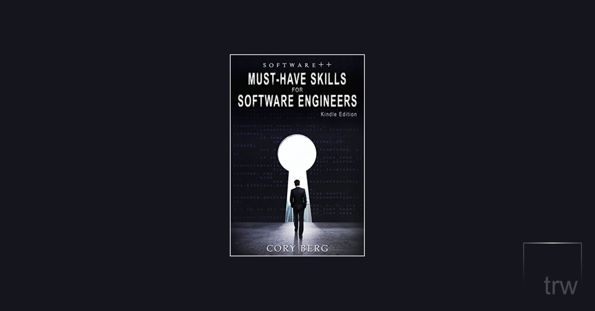

Yes, software engineers are notorious for being introverted, smug, know-it-alls, and these soft skills are important. But I feel like most software developers, at least the ones I know, would already have this down.

Some of the tropes in this book are accurate, i.e.:

> Engineers are very intelligent, and sometimes we feel like we need to let the world know how smart we really are. We make up acronyms that nobody else understands and use overly obtuse terminology with some degree of pride. If left unchecked, we can explain solutions from the highest level of detail, to the lowest level, covering everything in between. In certain audiences, this behavior leads to adverse outcomes.

But not *most* programmers, at least not the ones working in software today.

## Humility

One of the things that stood out to me was being *humble* and admitting your mistakes.

This passage reminded me of the great [Dan Abramov](https://twitter.com/dan_abramov) who has found great success building "tools for humans" and ended up building React at Facebook:

> They are willing to admit mistakes (see Skill #9: Own Your Mistakes), and to admit that they do not have all the “correct” answers. Their humility and lack of defensiveness is one of the most compelling reasons these engineers rise to the top, as working with them is much easier.

Dan does this in spades. Check out Dan's [Things I Don’t Know as Of 2018](https://overreacted.io/things-i-dont-know-as-of-2018/) article to see what kind of dev he is. He inspires me everyday.

## Some confusing points

In the *Attitude is Everything* section, Cory talks about refraining from saying things like, "this is a stupid idea" and all the other things you could say to make yourself look like an ass.

Cory addresses the point that instead of saying "I have to..." you could say, "I choose to..." to give yourself power over the situation which, I guess could help in some way.

But then he goes on to talk about *what other people say* when they say things like, "I have to...". Example:

> “I have to....” or “It makes me....” and see if you can determine a correlation between their powerless speech and their actual physical condition. For example, someone who uses the phrase “it makes me sick” might be frequently ill. Someone who says “get off my back” may have actual back or posture problems.

I'm not sure what the point was here; what does the person's physical health have to do with the topic at hand? I don't know, and if you do let me know on [Twitter](https://twitter.com/TiffanyW_412).

## Good book for the most part

Seeing as I am a developer looking for her next gig, this book had some invaluable insights into corporate structures and a reminder to work on my soft skills. The beginning started slow and jargon-y but it flattened out after *Section 1*.