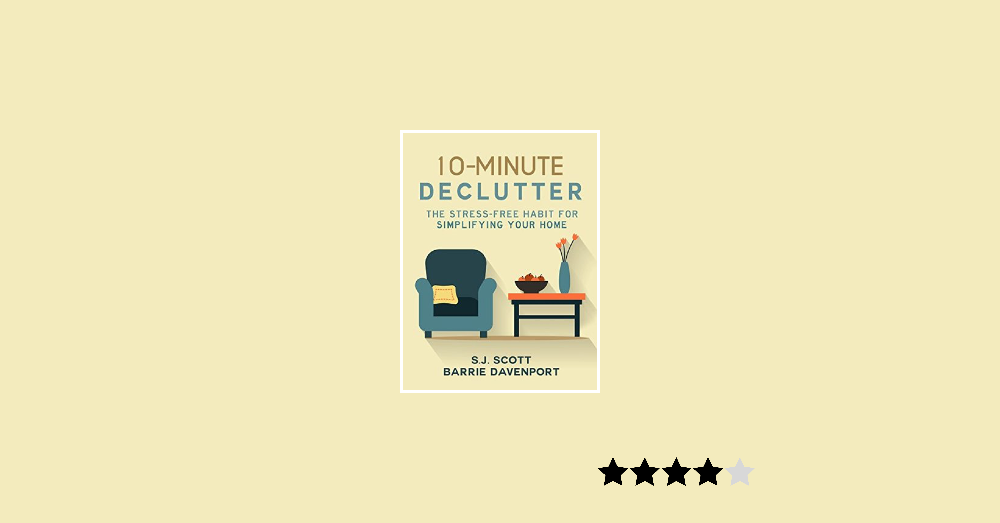

> Note: I am going to have the star rating I gave the book on Goodreads on the cover photo for each review from now on.

With all the talk about Marie Kondo's new Netflix Series, *Tidying Up* which is based on her book, [The Life-Changing Magic of Tidying Up: The Japanese Art of Decluttering and Organizing](https://www.amazon.com/Life-Changing-Magic-Tidying-Decluttering-Organizing-ebook/dp/B00KK0PICK/ref=tmm_kin_swatch_0?qid=&sr=&tag=thatmacnerd-20&_encoding=UTF8), [10 Minute Declutter](https://www.amazon.com/10-Minute-Declutter-Stress-Free-Habit-Simplifying-ebook/dp/B00XQGSPES/ref=sr_1_1_sspa?sr=8-1-spons&qid=1549687907&keywords=10%2BMinute%2Bdeclutter&sprefix=usb%2Bc%252Caps%252C137&psc=1&tag=thatmacnerd-20&crid=188A82AGXTKOP) is an alternative to Kondo's book and cheaper.

## The Basics

Barrie and SJ dive into your psyche; they want you to understand why you feel the need to keep the things cluttering your home. Did your mom give it to you after graduation? Is it that receipt you feel you'll need from 10 years ago at tax time?

Sentimental items are an easy trap for clutter. Guilt is a crazy deterrent. But what about the price of the item or the feeling that you may want to read that magazine someday?

These are some of the topics Barrie and SJ cover in the book.

## Thoughts

I liked this book better than Kondo's and not just because of the price. Kondo routinely wants you to ask yourself if something brings you joy. If it doesn't, get rid of it. This may be a cultural thing, as Kondo is Japanese. That being said, I'm not here for it.

There are lots of things in my apartment that don't bring me joy that I actually *need*. The premise may be from a different culture and I may be blinded by my narrow Western thinking but I found that whole thing ridiculous.

Reading this book was far more practical. For instance, I really don't like getting rid of things I pay a lot for. But in the book, SJ says:

> Paying for an item should have little bearing on your decision to keep it. The only question should be how much an item is worth to you today. If you no longer need it, then it should go.

This sounds good in theory but difficult in practice, as I am sure it is for many people. But I found this advice to make *sense* to me and I am trying to get rid of the things that don't add value to my life *right now*.

## Putting it into practice

Just a side note, I did throw away a bunch of old clothes I couldn't wear or were beyond repair. I bought some of the organizational buckets and baskets for things like cleaning supplies and TP. I found those things helpful.

The worst part of the book was the way the authors referred to themselves. *Barrie said*, *Steve did*. It was weird. I get why they did it, but I would have preferred some other method of distinguishing between authors.

## Recommend?

Yup. I gave it 4 stars because I really enjoyed it. Not everything in this book is doable but it gave me the motivation to actually get rid of things. My apartment isn't too cluttered because it is so large, but there *were* things I need to toss and this book was the spark I needed.

## Additional note

*This review contains affiliate links. If you buy from these links I get a small commission at no cost to you. You can buy from them or not. No biggie.*