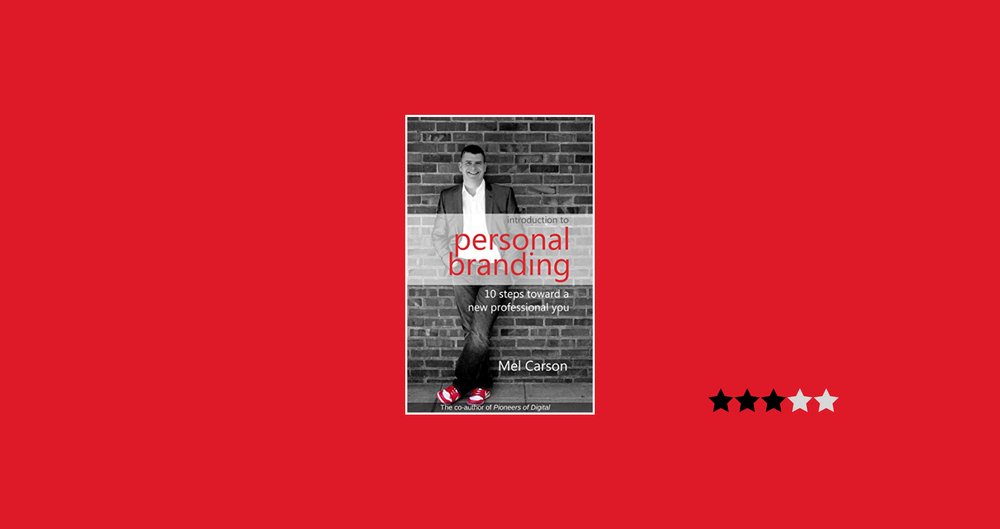

Overall, this was a decent book.

I got it from Kindle Unlimited some time ago and downloaded it for safe keeping.

As someone trying to build an online programmer "brand", I pick up books like these pretty regularly. They all have their strengths and weaknesses. Here I'll list the strengths and weaknesses of *this* particular book on personal branding.

### Strengths

- **Guidance on figuring out what your purpose is**. This is basically establishing why you do what you do. This is a simple concept, but a difficult one for a lot of people.

- **Emphasis on avoiding jargon and buzzwords in your LinkedIn profile and other networking tools**. This is a failing of many a book I've read on this topic. Keyword stuffing with the pipe (|) is a notorious tactic used by people on LinkedIn and something I have done, unfortunately.

- **Quality trumps quantity**. This is a no-brainer for most people but sometimes things bear repeating.

- **Making your personal brand discoverable**. Tips: use your real name, use backlinking and keywords on photos on your social profiles so that they all link together in search engines,use the same photo for all social sites, crosslink your social profiles, and start speaking, all good advice.

- **Learning how to listen and practicing empathy**. This is good *general life advice*.

### Weaknesses

- Making comments on blogs is not a great thing to do to get noticed. He says do it authentically and intelligently, but *how* do you accomplish this without seeming desperate?

- Add your social profiles to Out of Office Auto-responders. No. Just. Don't do that.

- The 38 page books is riddled with links to his content. These are just blog posts strung together to make a book and get a quick buck while shilling his marketing firm. I dislike these kinds of stunts.

## Overall

This book was just *okay* and had little more insight than I got from other books. His emphasis on being authentic is commendable, but the message is all for naught as he sprinkles this pamphlet with his blog links.