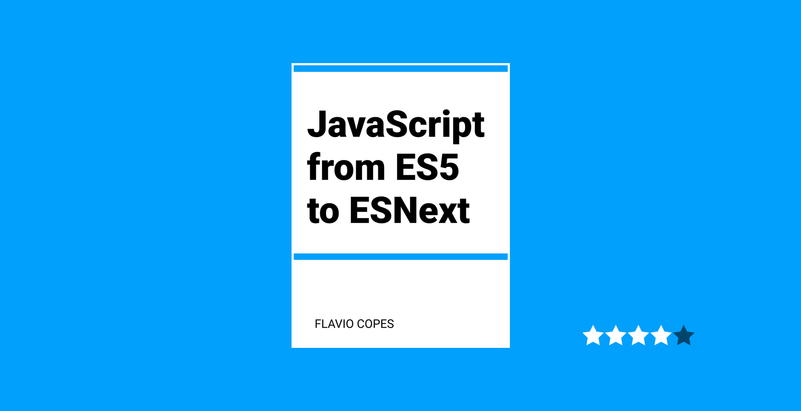

There was not much in this book that I didn't know, but what I *didn't know* this book explained it quite well. There were things I had heard of like `Maps`, `WeakMaps`, `Sets`, and `WeakSets` that didn't *quite* make sense to me but Flavio gave me the gist of each with code snippets and clearly defined explanations.

## Thoughts

You can read this book in a day or two, it's that short. You have to sign up for his newsletter to get access to these quick reads but it is worth it if you want information like this in book form.

I guess that's the rub: these are basically blog posts collected into a book in order to get you signed up for his newsletters so that he can convert you into a paying customer for his courses. I get the rationale and I totally did it. But I feel like Flavio could put *something more* for asking me to add *another* newsletter to my inbox.

The good news is services like [Kill the Newsletter](https://www.kill-the-newsletter.com/) to save your inbox, however it doesn't seem to work for double opt-ins as there is no inbox for you to do a second opt-in in Kill the Newsletter.

## Good if you like blog books

If you aren't offended by free books that are basically a collection of blog posts to get you to sign up for a newsletter to sell you a course, then I suggest you check out Flavio's books. I happen to like his content so that's why the high rating.