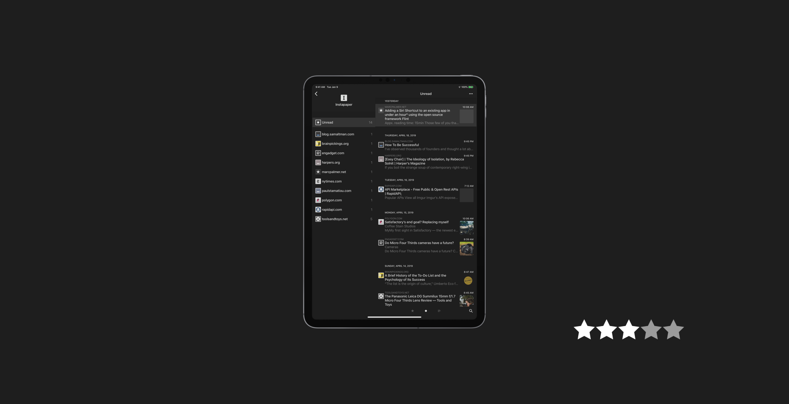

This was a really cool read and free from [Matt's website](https://www.matthewcassinelli.com/reeder-4/).

This isn't a basics overview; it presumes you've used an RSS reader before and that you know how to use iOS and its features. It goes over why he likes Reeder, the different views, styling, and advanced features.

The thing I liked most was the explanation of his reading workflow:

> For me, using Reeder lets me efficiently process my incoming stories, either from the list view or by jumping down through each full story, giving a fantastic flow to the experience.

> I’ve set it up for my RSS feeds synced via Feedly and articles I’ve saved for later in Instapaper.

This is great but then he explains further:

> Once I’ve saved the stories I want to read, I then jump into the Instapaper view and go through any links I’ve added that don’t necessarily work great as “read it later” articles. Any Amazon links or YouTube videos I will tend to shoot off to Reading List to easily process in Safari, making this fall out into a sort of three-tier system:

> 1. Feedly for incoming feeds
> 2. Instapaper for reading later
> 3. Reading List for non-article links

> Then, I usually have a minimal amount of stories to read and I come back to them when I’m ready, either right away in Reeder or later in Instapaper, and with Shortcuts ready to go if I’m in my Reading List in Safari.

This is great because I have a considerable amount of articles I need to read and process whether it is for things I'd like to write about or reference later. This gives me some inspiration and something to think about.

## Issues

There are some minor copy errors and style issues but since this is a free book made from an article, it doesn't bother me too much. Still, it might bother someone, somewhere, on the internet.

## 3 Stars

If you're a nerd, journalist/writer, or any other person looking to get their news from RSS and need an RSS reader that is as customizable as it is beautiful, Reeder 4 is your app and Matt's book will help you get the most out of it.
